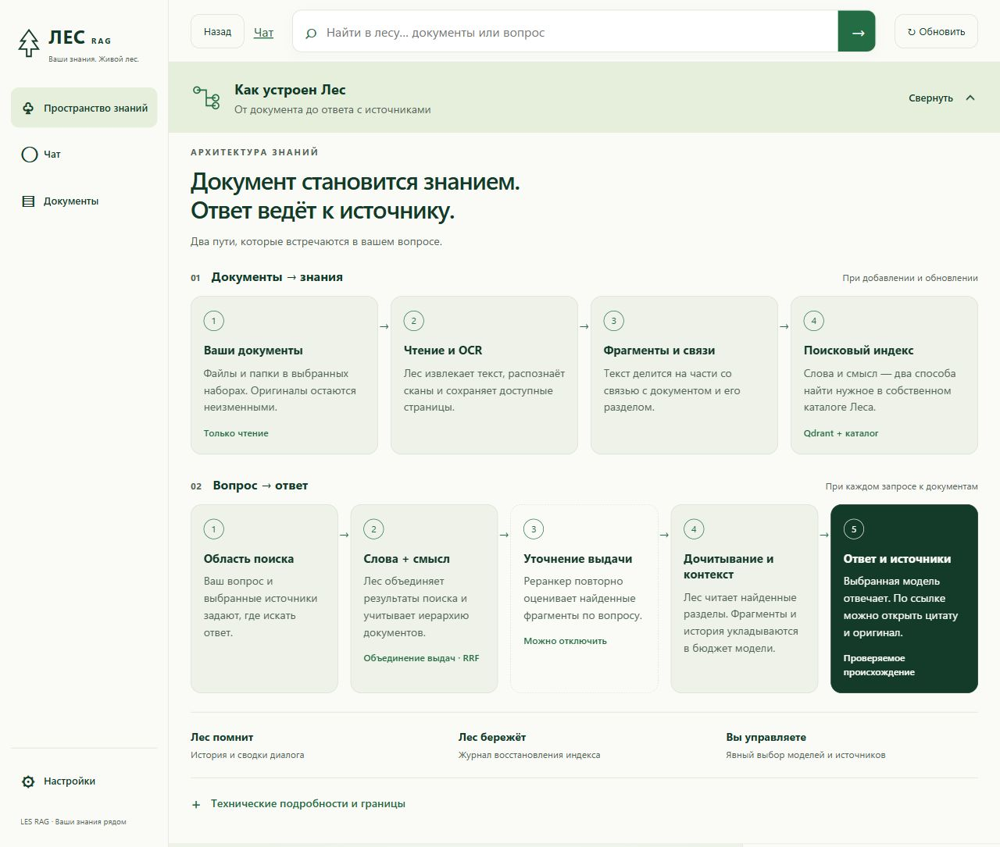

<strong>Ваши документы. Память проекта. Ответы с источниками.</strong>

<a href="https://github.com/proovcme/LES/releases/latest/download/LES-RAG-Web-Setup.exe"><strong>Скачать для Windows</strong></a> · <a href="USER_GUIDE.md">Начать работу</a> · <a href="docs/public/developer-guide.md">Разработчикам</a>

LES RAG — рабочее пространство для разговоров с ИИ и поиска по вашим документам.
Подключите модель, добавьте папку, создайте проект. Задавайте вопросы и открывайте
источник прямо из ответа.

> **Исходники — build 760; снимки интерфейса ниже — build 755.** Скачиваемый
> установщик пока содержит **0.1.0 / build 743**. [Изменения и проверки](docs/RELEASE_LEDGER.md).

## Больше места для разговора

Чат занимает рабочую область. Проекты выбираются по кнопке, а файлы, память
и источники открываются по необходимости. Ответ появляется потоком.

## От вопроса к доказательству

Лес ищет **по словам и смыслу**, при необходимости уточняет выдачу реранкером,
дочитывает найденный раздел и укладывает материал в контекст модели.
Рядом с ответом — имя документа, цитата и доступ к оригиналу.

## Как устроен Лес

**BM25 + смысловой поиск → RRF → необязательный реранкер → чтение раздела → ограниченный контекст → ответ с источниками.**

Полноценный BM25 учитывает частоту слов и длину фрагментов. Реранкер по умолчанию
выключен. История, память и документы делят доступный контекст; ссылки в ответе
ведут к материалам, переданным модели. Обновление индекса защищено журналом восстановления.

[Поиск и ранжирование](docs/modules/rag-ranking.md) · [Дочитывание и контекст](docs/modules/chat-section-context.md) · [Проверка BM25](docs/acceptance/bm25-index-755.md)

## Подключите один раз

**Установите → подключите модель → добавьте документы → создайте проект.**

Локальная Ollama или совместимый OpenAI API. Вы отдельно выбираете модель ответов
и модель поиска. Python и собственный Qdrant входят в установку; Docker не нужен.

## Документы на своих местах

Добавляйте файлы и папки в чат или в набор знаний. Лес показывает готовность
обработки, распознаёт сканы и следит за изменениями подключённых папок, пока открыт.
Исходники используются только для чтения; база и индекс хранятся отдельно.

## Лес помнит

У проекта — свои чаты, источники и заметки. Длинный разговор можно сжимать
в сводку, а память — просматривать, исправлять или отключать.
Память помогает продолжить работу; факты проверяются по документам.

## В лесу нельзя заблудиться

Каждое дерево — документ, каждая роща — набор знаний.
С карты можно перейти к файлам, поиску или разговору.

*Все семь снимков сделаны в работающем build 755 на вымышленном проекте
«Зелёная библиотека». Чат показывает сохранённый демонстрационный разговор;
снимки не являются новым замером качества или скорости модели.*

## Ещё возможности

OCR · чтение почты и вложений · MCP · API · CLI · проверка обновлений из GitHub.

Windows x64. Модели подключаются отдельно. Маленький установщик скачивает пакет;
при отсутствии WebView2 понадобится интернет. Установщик пока без подписи издателя.

Обработка больших таблиц остаётся экспериментальной. Качество OCR и выводы модели
нужно проверять по оригиналам. [Ограничения и бэклог](docs/BACKLOG.md).

[Руководство](USER_GUIDE.md) · [Установка из CLI](docs/public/les-light/README.md#установка) · [Выпуск 0.1.0](https://github.com/proovcme/LES/releases/tag/v0.1.0) · [Лицензия LES](LICENSE)

## macOS preview

Локальная браузерная редакция для Mac: собственный Qdrant, отдельное состояние,
OCR через Apple Vision. [Установка, зависимости и ограничения](docs/MACOS_PREVIEW.md).
Это кандидат build 760; подписанный установщик для macOS пока не публиковался.

Полный чат и сохранность источников проверяются на отдельном синтетическом корпусе:
[кандидат 760 и ограничения](docs/acceptance/full-chat-760.md).
