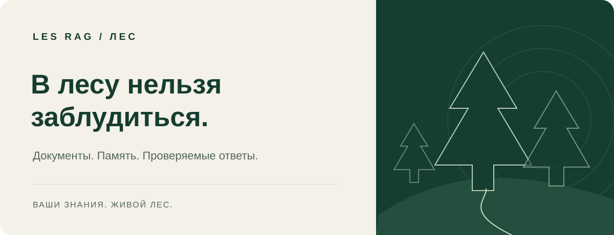
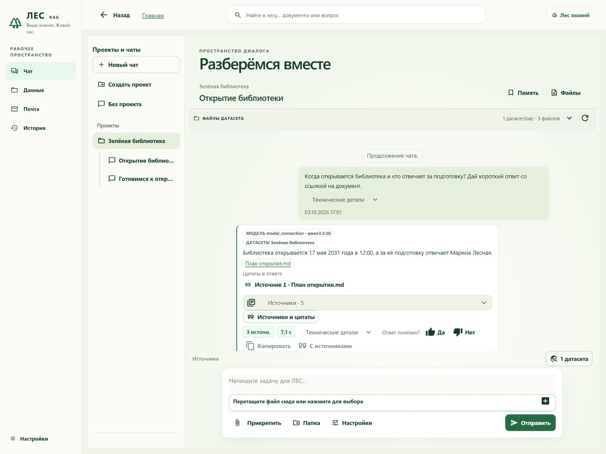
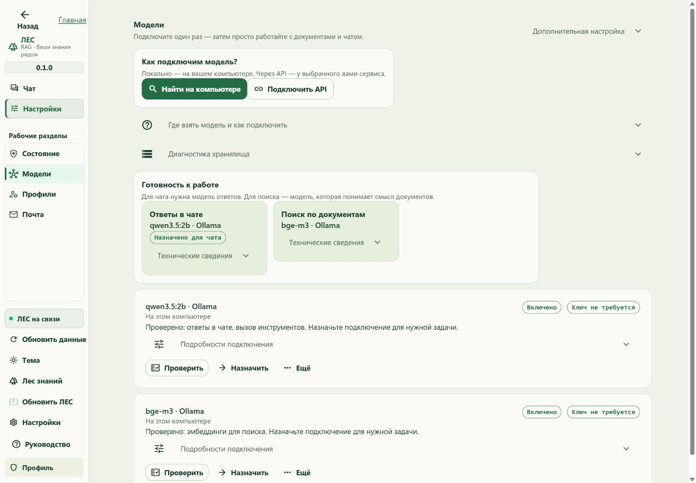
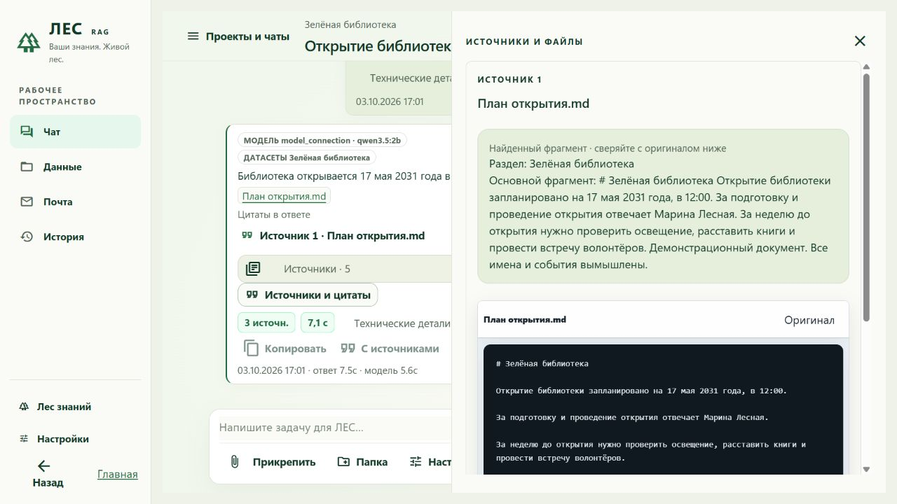
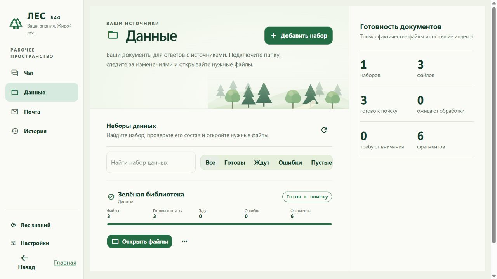
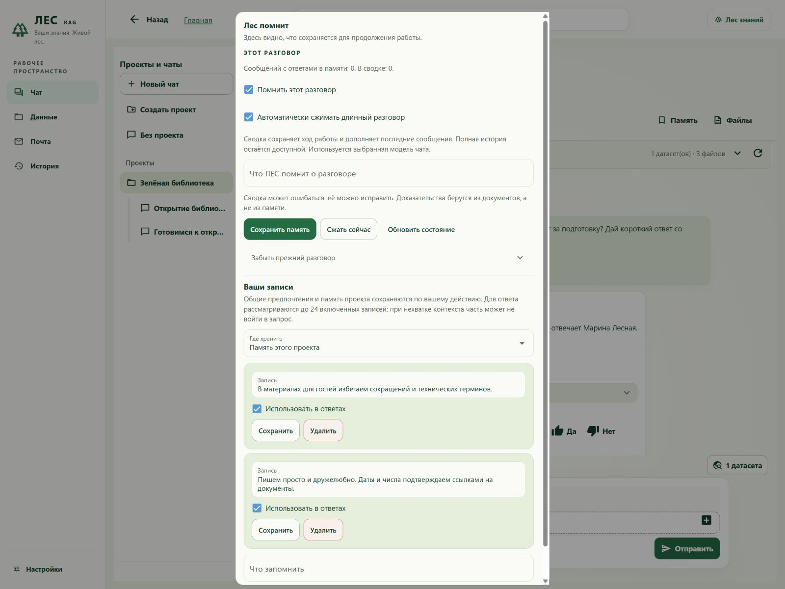
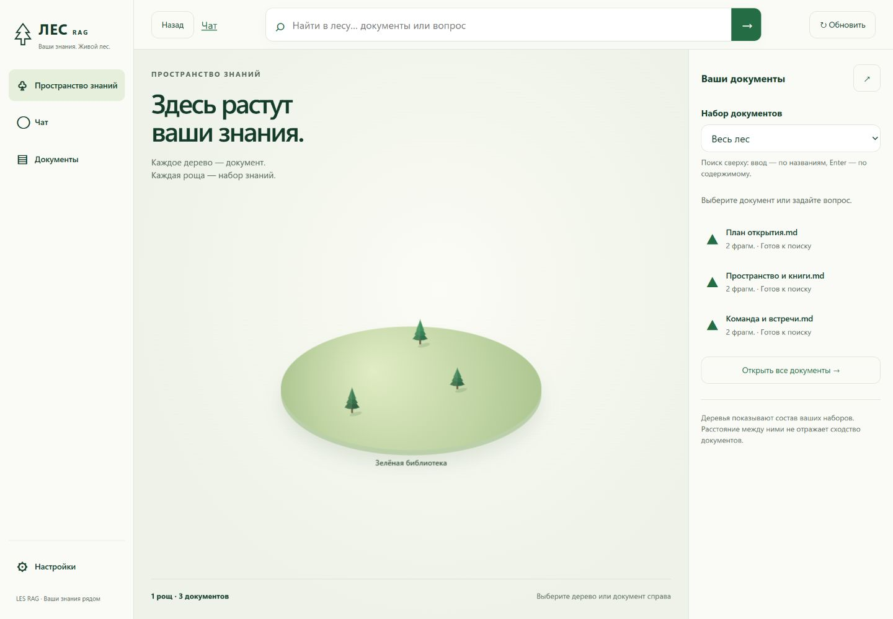

<strong>Ваши документы. Понятные ответы. Источники рядом.</strong>

<a href="https://github.com/proovcme/LES/releases/latest/download/LES-RAG-Web-Setup.exe"><strong>Скачать для Windows</strong></a> · <a href="USER_GUIDE.md">Руководство</a> · <a href="https://github.com/proovcme/LES/releases/latest">Все варианты установки</a>

LES RAG помогает разобраться в документах и продолжать работу с того места, где вы остановились.
Подключите модель, добавьте папку, задайте вопрос. Лес найдёт нужное и покажет, откуда взят ответ.

## Начать просто

**Установите → подключите модель → добавьте документы → создайте проект.**

Маленький установщик сам скачает всё необходимое. Можно использовать модель на своём компьютере
или подключить сервис через API. Исходные документы остаются на своём месте.

## Лес показывает доказательство

Рядом с ответом — понятное имя документа. Откройте фрагмент и проверьте оригинал.

## Документы в порядке

Добавляйте файлы и папки. Лес следит за изменениями, читает сканы и показывает, что уже готово к поиску.

## Лес помнит

У каждого проекта — свои разговоры, источники и важные заметки. Память можно посмотреть,
исправить или отключить.

## В лесу нельзя заблудиться

Ваши документы видны на карте. Из рабочих разделов можно вернуться назад или на главную.

*На скриншотах — вымышленный проект «Зелёная библиотека» в работающем LES RAG 0.1.0.*

## Ещё полезное

Файлы и папки в чате · поток ответа · OCR · чтение почты · MCP · API · CLI · обновления из GitHub.

[Подробное руководство](USER_GUIDE.md) · [Что пока не поддерживается](BACKLOG.md) · [Проверки выпуска](docs/public/les-light/RELEASE_REPORT.md) · [Для разработчиков](docs/public/developer-guide.md)

## Текущая разработка

В `main` — build **755**: полноценный BM25, дочитывание разделов, ограниченный контекст,
отдельные цитаты, восстановление индекса и более просторный чат.
[Что изменилось и проверено](docs/RELEASE_LEDGER.md) · [Проверка BM25](docs/acceptance/bm25-index-755.md).

Скачиваемый установщик пока содержит прежний выпуск **0.1.0 / build 743**.
Обработка больших таблиц в исходниках остаётся экспериментальной и не прошла
приёмку для выпуска. [Текущие ограничения и задачи](docs/BACKLOG.md).

Windows x64. Модели подключаются отдельно. При первой установке может понадобиться интернет для WebView2.
Установщик пока без подписи издателя. Важные выводы модели проверяйте по источникам.

Исходники доступны по [лицензии LES](LICENSE). Лицензии сторонних компонентов прилагаются к установке.
